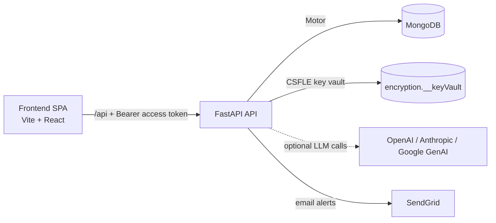

# Engineering Reference Guide

## 1. System Overview

### Tech stack (dependencies)
**Backend (requirements.txt):**
- fastapi==0.136.1
- uvicorn[standard]==0.46.0
- motor==3.7.1
- python-jose[cryptography]==3.5.0
- passlib[bcrypt]==1.7.4
- pydantic[email]==2.13.3
- python-multipart==0.0.27
- openpyxl==3.1.5
- reportlab==4.5.0
- arabic-reshaper==3.0.1
- python-bidi==0.6.7
- sendgrid==6.12.5
- python-dotenv==1.2.2
- pyotp==2.9.0

**Frontend (package.json dependencies):**
- react@^18.3.1
- react-dom@^18.3.1
- react-router-dom@^6.23.1
- axios@^1.7.2
- recharts@^2.12.7
- @tanstack/react-query@^5.45.1
- react-hook-form@^7.52.0
- date-fns@^3.6.0
- qrcode.react@^3.1.0

**Frontend (devDependencies):**
- vite@^5.3.1
- @vitejs/plugin-react@^4.3.1
- eslint@^8.57.0

### High-level architecture


### Frontend ↔ backend communication
- **Base URL:** Axios baseURL is `/api` (frontend/src/services/api.js).
- **Auth header:** `Authorization: Bearer <access_token>` is injected by the Axios request interceptor.
- **Cookie strategy:** Refresh token is stored as an HTTP-only cookie (`refresh_token`, `SameSite=Lax`, `Secure` in production). Axios uses `withCredentials: true` so the cookie is sent automatically.
- **Local dev proxy:** Vite proxies `/api` → `http://localhost:8000` and rewrites `/api` away (frontend/vite.config.js).

### Deployment topology
- **Backend:** Render web service (`render.yaml`) running FastAPI via Uvicorn.
- **Frontend:** Vercel (single-page app with rewrite to `/index.html`).
- **Database:** MongoDB (connection via `MONGO_URL`, intended for Atlas or equivalent).
- **AI providers:** Optional external LLM APIs (OpenAI, Anthropic, Google) when enabled.
- **Email:** SendGrid (optional, for submission/status alerts).

## 2. Authentication & Security

### Login flow (standard + MFA)
1. **POST /auth/login** with email + password.
2. Backend verifies bcrypt hash and updates `last_login`.
3. **If MFA enabled:** returns `{ requires_mfa: true, temp_token }` (short-lived access token with `mfa_pending`).
4. **If MFA not enabled:** returns access token + user profile, and sets refresh cookie.
5. **MFA verification:** frontend stores `temp_token` in sessionStorage, then POSTs `/auth/mfa/verify` with TOTP code. On success, backend enables MFA, returns access token, and sets refresh cookie.

### JWT access token claims
Issued by `auth_service.create_access_token()`:
- `user_id` (from user document or claims)
- `sub` (same as `user_id`)
- `role`
- `facility` (facility name)
- `administration`
- `governorate`
- `tier`
- `token_type` = `"access"`
- `exp`, `iat`
- `mfa_pending` (only for temporary MFA tokens)

### Refresh token strategy
- **Storage:** JWT refresh token is stored in an HTTP-only cookie named `refresh_token`.
- **Server persistence:** Hashed with bcrypt and stored in `users.refresh_tokens` as `{ jti, token_hash, created_at }`.
- **Rotation:** No rotation on `/auth/refresh`; refresh only issues a new access token.
- **Retention:** Only the most recent 10 refresh tokens are stored per user (`$slice: -10`).
- **Revocation:** `/auth/logout` removes the matching refresh token hash and clears the cookie.

### MFA
- **Library:** `pyotp` (TOTP).
- **Secret storage:** `users.mfa_secret` (Base32), with `mfa_enabled` + `mfa_enrolled_at`.
- **Verification window:** `valid_window=1` (one time-step tolerance).

### Frontend token lifecycle
- **Access token location:** In-memory module variable (`frontend/src/services/api.js`), not persisted.
- **Silent refresh:** Axios response interceptor retries once on 401 by calling `/auth/refresh` and replays the original request.
- **Session restore:** `AuthContext` calls `restoreSession()` on load (`/auth/refresh` then `/auth/me`).
- **Idle timeout:** 15 minutes of inactivity with a warning at 13 minutes (custom timers in api.js + `SessionExpiryWarning`).

### Role middleware (`require_role`)
- Depends on `auth_service.get_current_user`.
- Checks `claims.role` against allowed roles; raises HTTP 403 if not allowed.
- `get_current_user` also rejects tokens with `mfa_pending` and verifies the user is active.

### must_change_password enforcement
- **Backend:** `UserCreate` forces `must_change_password = True` on provisioning; `/auth/change-password` clears it.
- **Frontend:** `AuthContext` expects `must_change_password` in login response and redirects to `/change-password` if set.
- **Gap:** `/auth/login` currently does not include `must_change_password` in its response, so frontend enforcement does not trigger (see Known Gaps).

## 3. Database

### Connection setup & lifespan
- Motor client is created in `app/db/database.py` during FastAPI lifespan.
- `create_indexes()` runs on startup (idempotent).
- Client is closed on shutdown.

### Collections
- **incidents:** Core incident reports (with embedded `ai_metadata`).
- **facilities:** Facility list + patient reporting UUIDs.
- **users:** User accounts, roles, refresh tokens, MFA secrets.
- **model_registry:** AI model registry entries.
- **counters:** Atomic counters (currently `incident_seq`).
- **encryption.__keyVault:** CSFLE key vault (only when CSFLE enabled).

### Indexes (db/indexes.py)
**incidents**
- `incidents_description_text` — text index on `description`
- `incidents_incident_id_unique` — unique on `incident_id`
- `incidents_governorate` — `governorate` ascending
- `incidents_administration` — `administration` ascending
- `incidents_status` — `status` ascending
- `incidents_registration_date` — `registration_date` descending
- `incidents_reporter_type` — `reporter_type` ascending

**facilities**
- `facilities_patient_link_uuid_unique` — unique on `patient_link_uuid`
- `facilities_governorate_administration` — compound on `governorate`, `administration`

**users**
- `users_email_unique` — unique on `email`

### CSFLE (Client-Side Field Level Encryption)
Enabled when `CSFLE_ENABLED=true` and `CSFLE_LOCAL_MASTER_KEY` is provided.
Encrypted fields in `incidents`:
- `medical_file_number` — **Deterministic** (`AEAD_AES_256_CBC_HMAC_SHA_512-Deterministic`)
- `involved_person` — **Random** (`AEAD_AES_256_CBC_HMAC_SHA_512-Random`)
- `responsible_manager` — **Random**
- `disclosure_responsible` — **Random**
- `description` — **Random**
- `specific_error` — **Random**
- `notes` — **Random**

### Counters collection
- Document shape: `{ _id: "incident_seq", seq: <int> }`
- Used in `incident_service._next_incident_seq()` to generate yearly `incident_id` values (OVR-YYYY-###).

## 4. Data Models (backend/app/models)

### User models (user.py)
**UserBase**
- `email: EmailStr`
- `full_name: str`
- `role: UserRole`
- `facility_name: str`
- `administration: str`
- `governorate: str`
- `tier: int`

**UserCreate(UserBase)**
- `password: str`
- `must_change_password: bool = True`
- **Validation:** model validator forces `must_change_password=True` for creation payloads.

**UserInDB(UserBase)**
- `user_id: str`
- `hashed_password: str`
- `must_change_password: bool = True`
- `is_active: bool = True`
- `created_at: datetime`
- `last_login: datetime | None = None`
- `mfa_enabled: bool = False`
- `mfa_secret: str | None = None`
- `mfa_enrolled_at: datetime | None = None`
- `refresh_tokens: list[dict] = []` (entries: `{jti, token_hash, created_at}`)

**UserResponse(UserBase)**
- `user_id: str`
- `is_active: bool`

### Facility models (facility.py)
**FacilityInDB**
- `id: str | None` (`_id` alias)
- `governorate: str`
- `facility_type: FacilityType`
- `administration: str`
- `facility_name: str`
- `patient_link_uuid: str`
- `created_at: datetime`

**FacilityResponse**
- `facility_id: str`
- `governorate: str`
- `facility_type: FacilityType`
- `administration: str`
- `facility_name: str`
- `patient_link_uuid: str`
- `created_at: datetime`

**FacilitySafeResponse**
- `governorate: str`
- `facility_type: FacilityType`
- `administration: str`
- `facility_name: str`
- `created_at: datetime`

### AI models (ai_metadata.py)
**AIFeedback**
- `ai_suggested: str | None`
- `human_chose: str | None`
- `reviewer_id: str | None`
- `reviewed_at: datetime | None`

**AIMetadata**
- `auto_classification: str | None`
- `auto_event_type: str | None`
- `classification_score: float | None`
- `ai_risk_score: int | None`
- `similar_incident_ids: list[str] | None`
- `signal_flags: list[str] | None`
- `embedding_vector: list[float] | None`
- `embedding_id: str | None`
- `model_version: str | None`
- `processed_at: datetime | None`
- `human_reviewed: bool = False`
- `feedback: AIFeedback = AIFeedback()`
- `AIMetadata.empty()` returns a default instance with null/empty fields.

### Incident models (incident.py)
**IncidentCreate** (submission payload)
- Required: `occurrence_date: date`, `occurrence_time: str`, `description: str`, `occurrence_location: str`, `reporting_department: str`,
  `error_classification: ErrorClassification`, `event_type: EventType`, `severity: Severity`, `facility_name: str`, `facility_type: FacilityType`,
  `governorate: str`, `reporter_role: str`, `involved_person: str`
- Optional: `responsible_manager: str | None`, `recommendations: str | None`, `notes: str | None`, `specific_error: str | None`,
  `medical_file_number: str | None`, `disclosure_date: date | None`, `disclosure_method: DisclosureMethod | None`,
  `disclosure_responsible: str | None`, `vulnerable_patient: bool | None`, `vulnerable_population_type: VulnerablePopulationType | None`,
  `workplace_violence: bool | None`, `medication_error_merp_category: str | None`

**IncidentInDB(IncidentCreate)**
- `id: str | None` (`_id` alias)
- `incident_id: str`
- `status: IncidentStatus = Created`
- `probability: Probability | None`
- `risk_score: int | None`
- `reporter_type: ReporterType`
- `reporter_user_id: str | None`
- `administration: str`
- `attachments: list = []`
- `audit_trail: list = []`
- `registration_date: datetime`
- `report_date: date | None`
- `report_time: str | None`
- `corrective_action: str | None`
- `preventive_action: str | None`
- `action_date: date | None`
- `action_time: str | None`
- `action_status: ActionStatus = Pending`
- `final_report: str | None`
- `ai_metadata: AIMetadata = AIMetadata.empty()`
- `jci_chapter: JCIChapter | None`
- `jci_standard: str | None`
- `jci_measurable_element: str | None`
- `jci_compliance_status: JCIComplianceStatus | None`
- `jci_evidence: str | None`
- `jci_gap_analysis: str | None`
- `jci_action_plan: str | None`

**IncidentResponse(IncidentInDB)**
- Same fields as `IncidentInDB`, with `_id` serialized as `id`.

## 5. Backend API Reference

### Root
| Method | Path | Auth | Response | Notes |
| --- | --- | --- | --- | --- |
| GET | `/` | None | `{ status, version, ai_provider }` | Lightweight health summary. |

### Auth (`/auth`)
| Method | Path | Auth | Request | Response | Notes |
| --- | --- | --- | --- | --- | --- |
| POST | `/auth/login` | None | `{ email, password }` | LoginResponse or MFALoginResponse | Sets refresh cookie when MFA not pending. |
| POST | `/auth/mfa/setup` | Required roles: quality_admin+ | — | `{ otpauth_uri, secret }` | Stores secret, `mfa_enabled=false`. |
| POST | `/auth/mfa/verify` | None (uses temp token) | `{ temp_token, totp_code }` | LoginResponse | Enables MFA, sets refresh cookie. |
| POST | `/auth/refresh` | Cookie | — | `{ access_token }` | Validates refresh token. |
| POST | `/auth/logout` | Cookie | — | `{ message }` | Revokes refresh token and clears cookie. |
| GET | `/auth/me` | Access token | — | `UserResponse` | Returns active user profile. |
| POST | `/auth/change-password` | Access token | `{ old_password, new_password }` | `{ message }` | Clears `must_change_password`. |

### Incidents (`/incidents`)
| Method | Path | Auth | Request | Response | Notes |
| --- | --- | --- | --- | --- | --- |
| GET | `/incidents/` | staff+ | Query: `skip`, `limit` | `IncidentResponse[]` | Scoped by role. |
| POST | `/incidents/` | staff, quality_admin | `IncidentCreate` | `IncidentResponse` | Triggers AI classification hook. |
| GET | `/incidents/{incident_id}` | staff+ | — | `IncidentResponse` | Scoped by role. |
| PATCH | `/incidents/{incident_id}/status` | quality_admin | `{ new_status }` | `{ updated, new_status }` | Enforces transition table. |
| PATCH | `/incidents/{incident_id}/assessment` | quality_admin | `{ severity, probability }` | `{ updated }` | Computes `risk_score`. |
| PATCH | `/incidents/{incident_id}/actions` | quality_admin | `{ corrective_action, preventive_action, action_date, action_time, action_status }` | `{ updated }` | Saves CAPA fields. |
| PATCH | `/incidents/{incident_id}/jci-fields` | quality_admin+ | JCI + disclosure fields | `{ updated, fields_set }` | Partial update (exclude_unset). |
| POST | `/incidents/{incident_id}/final` | quality_admin | `{ final_report }` | `{ updated, status }` | Marks Completed if allowed. |
| POST | `/incidents/{incident_id}/ai-feedback` | quality_admin | `{ ai_suggested, human_chose }` | `{ updated, human_reviewed }` | Saves AI feedback. |

### Patients (`/patients`)
| Method | Path | Auth | Request | Response | Notes |
| --- | --- | --- | --- | --- | --- |
| POST | `/patients/submit/{facility_uuid}` | None | PatientSubmitRequest | `{ incident_id, message }` | Anonymous report with default severity/classification. |
| GET | `/patients/token/{facility_id}` | top_management | — | `{ patient_link_uuid }` | Returns facility UUID by ID or name. |

### Facilities (`/facilities`)
| Method | Path | Auth | Response | Notes |
| --- | --- | --- | --- |
| GET | `/facilities/` | None | `FacilitySafeResponse[]` | Public list without UUIDs. |
| GET | `/facilities/cascading` | None | `{ governorates, administrations, facilities }` | For dropdowns. |
| GET | `/facilities/full` | top_management | `FacilityResponse[]` | Includes patient_link_uuid. |

### Analytics (`/analytics`)
| Method | Path | Auth | Response | Notes |
| --- | --- | --- | --- |
| GET | `/analytics/summary` | access token (tier ≥ 2) | `{ status[], severity[], event_type[] }` | Aggregated counts. |
| GET | `/analytics/trends` | access token (tier ≥ 3) | `[{ month, count }]` | Last 12 months. |
| GET | `/analytics/compare` | access token (tier ≥ 4) | `[{ label, count }]` | Dimension = facility or governorate. |

### Exports (`/exports`)
| Method | Path | Auth | Response | Notes |
| --- | --- | --- | --- |
| GET | `/exports/excel` | access token | XLSX stream | Synchronous export of all scoped incidents. |
| GET | `/exports/pdf/{id}` | access token | PDF stream | Arabic-enabled PDF for one incident. |

### Users (`/users`)
| Method | Path | Auth | Request | Response | Notes |
| --- | --- | --- | --- | --- | --- |
| GET | `/users` | top_management | Query: `skip`, `limit` | `UserResponse[]` | Excludes hashes/refresh tokens. |
| POST | `/users/` | top_management | `UserCreate` | `UserResponse` | Creates account. |
| PATCH | `/users/{user_id}/deactivate` | top_management | — | `{ message }` | Sets `is_active=false`. |
| POST | `/users/provision/facility/{facility_id}` | top_management | — | FacilityProvisionResult | Creates staff + quality_admin accounts. |
| POST | `/users/provision/tier` | top_management | TierUserRequest | TierUserResult | Creates higher-tier user. |

### AI (`/ai`)
| Method | Path | Auth | Response | Notes |
| --- | --- | --- | --- |
| POST | `/ai/classify/batch` | top_management | `{ processed }` or disabled response | Processes unclassified incidents. |
| POST | `/ai/classify/{incident_id}` | top_management | `AIMetadata` or disabled response | On-demand classification. |
| GET | `/ai/models` | top_management | `[{...}]` | Lists model registry. |
| POST | `/ai/models` | top_management | `{ name, version, provider, model_type, metadata? }` | `{ id }` | Creates registry entry. |
| GET | `/ai/similar/{incident_id}` | top_management | 501 | Vector search stub. |
| GET | `/ai/signals` | top_management | 501 | Signal detection stub. |
| GET | `/ai/signals/{governorate}` | top_management | 501 | Signal detection stub. |

### Health (`/health`)
| Method | Path | Auth | Response | Notes |
| --- | --- | --- | --- |
| GET | `/health` | None | `{ status, db, ai_provider, sendgrid, version }` | Pings MongoDB. |

## 6. Service Layer

### auth_service.py (authentication & JWT)
- `hash_password(plain: str) -> str` — bcrypt hash.
- `verify_password(plain: str, hashed: str) -> bool` — bcrypt verify.
- `generate_temporary_password(length=12) -> str` — temp password generator.
- `generate_temp_password(length=12) -> str` — temp password with symbols.
- `build_login_response(access_token, user_doc) -> dict` — unused helper.
- `create_access_token(data, expires_delta=None) -> str` — JWT access token.
- `create_refresh_token(user_id: str) -> str` — JWT refresh token.
- `decode_token(token: str) -> dict` — validates JWT.
- `authenticate_user(email, password, db) -> UserInDB | None` — verifies credentials.
- `change_user_password(user_id, current_password, new_password, db) -> bool` — password change for self.
- `change_password(db, user_id, old_password, new_password) -> dict` — endpoint helper.
- `get_current_user(token=Depends, db=Depends) -> dict` — validated claims.
- `store_refresh_token(user_id, refresh_token, db) -> None` — stores hashed refresh token.
- `verify_refresh_token(user_id, refresh_token, db) -> bool` — bcrypt match.
- `invalidate_refresh_token(user_id, refresh_token, db) -> bool` — removes token entry.
- `generate_mfa_secret() -> str` — Base32 secret.
- `get_totp_uri(secret, username) -> str` — otpauth URI.
- `verify_totp(secret, code) -> bool` — TOTP verification.

### incident_service.py (incident workflow)
- `create_incident(data, reporter_type, user_id, db) -> IncidentInDB` — create incident + AI hook.
- `get_incidents(role, claims, db, skip=0, limit=50) -> list[IncidentResponse]` — paginated list.
- `get_incident_by_id(incident_id, role, claims, db) -> IncidentInDB | None` — scoped lookup.
- `update_status(incident_id, new_status, user_id, db) -> bool` — status transition.
- `save_assessment(incident_id, severity, probability, user_id, db) -> bool` — risk score update.
- `save_actions(incident_id, corrective, preventive, action_date, action_time, action_status, user_id, db) -> bool` — CAPA update.
- `save_final_report(incident_id, report_text, user_id, db) -> bool` — final report + Complete.
- `save_ai_feedback(incident_id, ai_suggested, human_chose, reviewer_id, db) -> bool` — AI feedback.

### facility_service.py (facilities)
- `get_facilities(db) -> list[FacilityResponse]` — full list with UUIDs.
- `get_facilities_safe(db) -> list[FacilitySafeResponse]` — public list without UUIDs.
- `get_cascading_options(db) -> dict` — nested dropdown data.
- `get_facility_by_patient_uuid(uuid, db) -> FacilityInDB | None` — lookup by patient UUID.
- `get_quality_admin_email(facility_name, db) -> str | None` — lookup QA email.

### ai_service.py (AI integration)
- `get_classification_prompt(description, facility_context) -> str` — prompt template.
- `classify_incident(description, facility_context) -> AIMetadata | None` — provider call + clamp.
- `batch_classify_unprocessed(db) -> int` — batch classification.

### email_service.py (SendGrid)
- `send_submission_alert(to_email, incident_id, facility, severity) -> None`
- `send_status_change_alert(to_email, incident_id, old_status, new_status) -> None`

## 7. AI Integration

### _ENABLED logic
- `_ENABLED = (AI_PROVIDER != "none") and bool(AI_API_KEY)`.
- If disabled or any provider call fails, AI functions return `None` without raising.

### Classification prompt template (exact)
```
You are an expert clinical-quality analyst at a Saudi healthcare facility.
Facility context: {facility_context}

Analyze the incident description below and return ONLY a JSON object — no markdown, no explanation, no surrounding text — with this exact structure:
{
  "error_classification": "<one of: {valid_classifications}>",
  "event_type": "<one of: {valid_event_types}>",
  "classification_score": <float 0.0-1.0>,
  "ai_risk_score": <integer 1-9>,
  "signal_flags": [<zero or more short alert strings>]
}

Rules:
- error_classification MUST be exactly one of the listed values.
- event_type MUST be exactly one of the listed values.
- classification_score is your confidence (0.0 = uncertain, 1.0 = certain).
- ai_risk_score is your overall risk assessment (1 = minimal, 9 = critical).
- signal_flags is an empty list unless the incident warrants a specific alert (e.g. 'sentinel_event', 'repeat_pattern', 'patient_harm').
- Return ONLY the JSON object. No additional text.

Incident description:
{description}
```

### Provider adapters and HTTP targets
- **OpenAI:** `POST https://api.openai.com/v1/chat/completions`
- **Anthropic:** `POST https://api.anthropic.com/v1/messages`
- **Google:** `POST https://generativelanguage.googleapis.com/v1beta/models/{model}:generateContent`

### On-submit hook behavior
- `incident_service.create_incident()` calls `ai_service.classify_incident()` **before** DB insert.
- If AI returns data, fields are merged into `incident.ai_metadata`.
- AI failure never blocks incident creation (returns `None`).

### Validation/clamping logic
- `error_classification` and `event_type` are validated against enum values; otherwise set to `null`.
- `classification_score` is clamped to `[0.0, 1.0]`.
- `ai_risk_score` is clamped to `[1, 9]`.
- `signal_flags` coerced to list of strings.

### Vector search status
- `ai_metadata.embedding_vector` exists (1536-dim) but no Atlas vector index creation in code.
- `db/indexes.py` notes vector index must be created manually.
- `/ai/similar/{incident_id}` and `/ai/signals` endpoints return 501 (not implemented).

## 8. Frontend Architecture

### Route map
| Path | Component | Access control | Notes |
| --- | --- | --- | --- |
| `/login` | `LoginForm` | Public | Email/password login; MFA redirect on demand. |
| `/mfa/verify` | `MFAVerify` | Public | Uses temp token from sessionStorage. |
| `/report/:uuid` | `PatientReport` | Public | Anonymous patient report form. |
| `/change-password` | `ChangePassword` | Public | Used after temp password (frontend-driven). |
| `/dashboard` | `Dashboard` | Auth (tier ≥ 2) | Shows analytics for tier ≥ 3. |
| `/incidents` | `Reports` | Auth (tier ≥ 2) | Incident list. |
| `/incidents/:id` | `IncidentDetail` | Auth (tier ≥ 2) | Incident detail view. |
| `/new` | `NewIncidentForm` | Auth (tier ≥ 2) | Staff/QA incident submission. |
| `/analytics` | `Analytics` | Auth (tier ≥ 3) | Analytics dashboard. |
| `/workflow` | `WorkflowPage` | Roles: quality_admin, administration_manager, governorate_manager, top_management | Workflow guide. |
| `/admin/provision` | `AdminProvision` | Role: top_management | Provision users + QR codes. |
| `*` | `FallbackRedirect` | — | Redirects to `/dashboard` or `/login`. |

### React Query configuration
- Default `staleTime`: **5 minutes** for all queries (frontend/src/main.jsx).
- Query keys:
  - `['analytics', 'summary']`
  - `['analytics', 'trends']`
  - `['analytics', 'compare', dimension]`
  - `['incidents', { page, pageSize }]`
  - `['incident', id]`
  - `['health']` (Sidebar, staleTime 60s)

### AuthContext
**State shape:** `{ user, loading, mustChangePassword, isAuthenticated, tier, role }`

**Exposed API:** `login`, `logout`, `onPasswordChanged`

**Session restore flow:**
- On mount, calls `authService.restoreSession()` once (shared promise to avoid StrictMode double calls).
- `restoreSession()` calls `/auth/refresh`, sets access token, then calls `/auth/me`.

## 9. Frontend Component Reference

**analytics/**
- `AnalyticsDashboard.jsx` — summary cards, trends chart, severity pie, and CompareView (tier ≥ 4).
- `TrendChart.jsx` — 12-month line chart from analytics trends.
- `CompareView.jsx` — horizontal bar chart with dimension toggle and local loading/errors.

**auth/**
- `LoginForm.jsx` — login UI; stores MFA temp token and navigates to `/mfa/verify` when required.

**incidents/**
- `AIBadge.jsx` — displays AI suggestion with accept/override flows.
- `IncidentCard.jsx` — summary card with status and AI pending tag.
- `IncidentDetail.jsx` — full incident view, workflow actions, AI feedback, JCI panel.
- `IncidentList.jsx` — paginated list with local search filters.
- `NewIncidentForm.jsx` — staff/QA incident submission form with cascading facility inputs.
- `RiskMatrix.jsx` — interactive 3×3 risk score matrix.
- `StatusBadge.jsx` — status pill badge.

**patient/**
- `PatientReportForm.jsx` — anonymous patient incident form.
- `QRCodeView.jsx` — QR code + copy/download actions for patient links.

**shared/**
- `Modal.jsx` — focus-trapped modal.
- `Sidebar.jsx` — role-based navigation + AI status badge + sign-out.
- `SessionExpiryWarning.jsx` — idle timeout warning + refresh/logout.
- `Navbar.jsx` — placeholder, not rendered.
- `DisclaimerBanner.jsx` — bilingual QA disclaimer banner.
- `Spinner.jsx` — SVG loading spinner.
- `EmptyState.jsx` — empty state card with optional action.

**workflow/**
- `WorkflowStep.jsx` — single step card.
- `WorkflowView.jsx` — workflow timeline + risk matrix reference.

## 10. Frontend Services & Hooks

### Services (frontend/src/services)
- `api.js`
  - `setToken(token)` / `getToken()` / `resetSessionTimers()`
  - Axios instance with `/api` baseURL, auth header injection, refresh-on-401
  - Idle timeout handling (15 min, warning at 13 min)
- `auth.js`
  - `login(email, password)`
  - `loginWithMeta(email, password)`
  - `logout()`
  - `getMe()`
  - `restoreSession()`
  - `changePassword(oldPassword, newPassword)`
- `incidents.js`
  - `getAll({ skip, limit })`
  - `getById(id)`
  - `create(payload)`
  - `updateStatus(id, newStatus)`
  - `saveAssessment(id, sev, prob)`
  - `saveActions(id, payload)`
  - `submitFinal(id, text)`
  - `submitAIFeedback(id, sug, chosen)`
  - `saveJCIFields(id, payload)`
  - `submitPatientReport(uuid, payload)`
- `analytics.js`
  - `getSummary()`
  - `getTrends()`
  - `getCompare(dimension)`
  - `getHealth()`
- `admin.js`
  - `provisionFacility(facilityId)`
  - `provisionTierUser(payload)`
  - `fetchFacilitiesFull()`

### Hooks (frontend/src/hooks)
- `useIncidents({ page, pageSize })` → queryKey `['incidents', { page, pageSize }]`
- `useIncident(id)` → queryKey `['incident', id]`
- `useCreateIncident()` → invalidates `['incidents']`
- `useUpdateStatus()` → invalidates `['incidents']`, `['incidents', id]`, `['incident', id]`
- `useSaveAssessment()` → invalidates `['incident', id]`
- `useAIFeedback()` → invalidates `['incident', id]`
- `useSaveJCIFields()` → invalidates `['incident', id]`
- `useAnalyticsSummary()` → queryKey `['analytics', 'summary']`
- `useAnalyticsTrends()` → queryKey `['analytics', 'trends']`
- `useAnalyticsCompare(dimension)` → queryKey `['analytics', 'compare', dimension]`
- `useAuth.js` — stub file (no hook implementation).

## 11. Risk Matrix

### Scoring matrix values
| Severity \ Probability | High | Medium | Low |
| --- | --- | --- | --- |
| Major | 9 | 6 | 3 |
| Moderate | 6 | 4 | 2 |
| Minor | 3 | 2 | 1 |

### Risk level thresholds
- **frontend/src/utils/riskMatrix.js:**
  - `>= 7` → Critical
  - `>= 5` → High
  - `>= 3` → Medium
  - `< 3` → Low
- **frontend/src/components/incidents/RiskMatrix.jsx:**
  - `>= 4` → High Risk
  - `== 3` → Medium Risk
  - `< 3` → Low Risk

## 12. Environment & Configuration

| Variable | Required | Default | Purpose |
| --- | --- | --- | --- |
| MONGO_URL | Yes | — | MongoDB connection string. |
| DB_NAME | Yes | — | Database name. |
| MONGO_DB_NAME | No | — | Legacy DB name fallback. |
| JWT_SECRET | Yes | — | JWT signing secret. |
| JWT_SECRET_KEY | No | — | Legacy JWT secret fallback. |
| JWT_ALGORITHM | No | `HS256` | JWT signing algorithm. |
| ACCESS_TOKEN_EXPIRE_MINUTES | No | `15` | Access token TTL (minutes). |
| REFRESH_TOKEN_EXPIRE_DAYS | No | `30` | Refresh token TTL (days). |
| ENVIRONMENT | No | `development` | `development` or `production`. |
| CORS_ORIGINS | No | empty (dev defaults to localhost) | Comma-separated allowed origins. |
| FRONTEND_URL | No | `http://localhost:3000` | Base URL for emails (not referenced in code). |
| SENDGRID_API_KEY | No | empty | SendGrid API key. |
| SENDGRID_FROM_EMAIL | No | empty | SendGrid sender email. |
| EMAIL_FROM | No | empty | Legacy sender email fallback. |
| PDF_ARABIC_FONT_PATH | No | empty | Optional TTF path for Arabic PDFs. |
| AI_PROVIDER | No | `none` | AI provider (`none|openai|anthropic|google`). |
| AI_API_KEY | No | empty | AI provider API key. |
| AI_MODEL | No | empty | AI model override. |
| CSFLE_ENABLED | No | `false` | Enable client-side field-level encryption. |
| CSFLE_LOCAL_MASTER_KEY | Conditionally | empty | Base64 96-byte master key (required when CSFLE enabled). |
| CSFLE_KEY_VAULT_NAMESPACE | No | `encryption.__keyVault` | CSFLE key vault namespace. |

## 13. Scripts & Seeding
- `backend/scripts/import_facilities.py` — imports/updates Facilities.csv into `facilities` collection; upserts by governorate + facility_name and preserves `patient_link_uuid` and `created_at`.
- `backend/scripts/seed_model_registry.py` — inserts a placeholder model registry document if absent.
- `backend/scripts/Facilities.csv` — seed data for governorates/administrations/facilities (Arabic + English fields).

## 14. Testing

### Backend tests (pytest)
- `backend/tests/test_baseline.py`
  - `test_risk_matrix_baseline_values`
  - `test_status_transition_baseline_rules`
  - `test_patient_submit_response_is_minimal_shape`

### Frontend tests
- `frontend/src/tests/scaffold.cases.js` (test case list only):
  - `authCases` entries:
    - restores session via /auth/me when access token is valid
    - refreshes token on 401 from /auth/me and retries request once
    - clears token and redirects to /login when refresh fails
  - `incidentWorkflowCases` entries:
    - sends new_status payload key for PATCH /incidents/:id/status
    - allows legal status transitions and blocks illegal transitions in UI flow
  - `patientSubmitCases` entries:
    - submits to /patients/submit/:uuid with anonymous payload
    - renders success message with incident_id and no internal fields
- `frontend/src/tests/README.md` — notes that no frontend test runner is configured.

### Test runner configuration
- **Backend:** pytest (no explicit config file found).
- **Frontend:** no test runner configured.

### Coverage gaps
- No API integration tests or database tests.
- No frontend automated tests beyond the scaffold list.
- No load/performance tests for analytics or exports.

## 15. Known Gaps & Recommended Next Steps
- `/ai/similar/*` and `/ai/signals*` endpoints return 501 (vector search & signal detection stubs).
- Atlas Vector Search index must be created manually; not automated in code.
- `frontend/src/hooks/useAuth.js` is a stub (no hook implementation).
- `frontend/src/components/shared/Navbar.jsx` is a placeholder and not wired into the layout.
- `must_change_password` is not enforced because `/auth/login` omits it from the response (frontend expects it).
- `MFASetup` posts `/auth/mfa/verify` with an empty `temp_token` (likely fails without adjustment).
- Risk-level thresholds differ between `riskMatrix.js` and `RiskMatrix.jsx` (UI vs utility).
- Frontend derives “High Risk” and “Pending AI Review” metrics instead of backend-provided fields.

## 16. Deployment & Operations

### Render (render.yaml)
- Build: `pip install -r requirements.txt && python scripts/seed_model_registry.py`
- Start: `uvicorn app.main:app --host 0.0.0.0 --port $PORT`
- Health check: `/health`
- Environment: `ENVIRONMENT=production`, `AI_PROVIDER=none` plus secrets.

### Docker (backend/Dockerfile)
- Base: `python:3.11-slim`
- Installs requirements, runs Uvicorn, non-root user `appuser`.
- Health check hits `/health` on port 8080.

### Vercel (frontend/vercel.json)
- SPA rewrite: all routes → `/index.html`.

### CORS behavior
- Uses `CORS_ORIGINS` env var; defaults to localhost origins in non-production.
- In production, `CORS_ORIGINS` must not contain `*` (credentials enabled).

### Production vs development differences
- Docs/redoc disabled in production.
- Refresh cookie uses `secure=true` in production.
- Startup checks enforce non-default JWT secret in production.

## 17. Changelog

| Date | Session | Changes |
| --- | --- | --- |
| | | |
