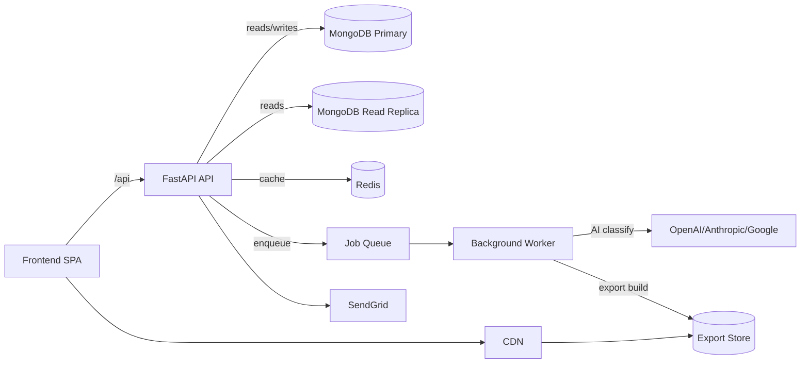

# Scalability Enhancement Plan

Target load: **50,000 incident reports/month** (~70/hour average, 5–10× peak during shifts/surges).

## 2.1 Bottleneck Analysis

### MongoDB
- **Missing compound indexes for scoped lists** — `incident_service.get_incidents()` filters by scope fields and sorts by `registration_date` but only single-field indexes exist (`backend/app/db/indexes.py`).
- **Counters hotspot** — `_next_incident_seq()` uses a single counter document (`backend/app/services/incident_service.py`) which can become a write hotspot at peak ingest.
- **CSFLE overhead** — client-side encryption for multiple fields (`backend/app/db/database.py`) adds latency to writes/reads when enabled.
- **Connection pool defaults** — `AsyncIOMotorClient` is created without pool sizing (`backend/app/db/database.py`).

### FastAPI/Uvicorn
- **Single worker** — Render start command uses `uvicorn app.main:app` without `--workers` (`backend/render.yaml`).
- **Blocking work on request thread** — exports and AI calls run in-line (routers/exports.py, services/incident_service.py).

### AI hook
- **Synchronous classification** — `create_incident()` calls `ai_service.classify_incident()` before insert (`backend/app/services/incident_service.py`).

### Export service
- **Blocking PDF/Excel generation** — `/exports/excel` and `/exports/pdf/{id}` compute and stream in-request (`backend/app/routers/exports.py`).

### Analytics
- **Unindexed aggregation scope** — `/analytics/*` pipelines match on role scope fields and group without supporting compound indexes (`backend/app/routers/analytics.py`, `backend/app/db/indexes.py`).
- **Frontend-side metrics** — High Risk and Pending AI Review are derived in `AnalyticsDashboard.jsx` instead of backend-provided aggregates.

### React Query
- **Long staleTime** — global `staleTime = 5m` (`frontend/src/main.jsx`) causes stale dashboards under peak load.
- **No prefetch for pagination** — `useIncidents` does not prefetch next page (`frontend/src/hooks/useIncidents.js`).

### Auth
- **bcrypt verification frequency** — each login and refresh token check uses bcrypt (`backend/app/services/auth_service.py`).
- **Refresh token lookup pattern** — lookup by `user_id` and `refresh_tokens.jti` without dedicated index (`auth_service.verify_refresh_token`).

## 2.2 Required Changes (must-do before going live at scale)

| Problem | Solution | Affected files | Complexity |
| --- | --- | --- | --- |
| AI classification blocks incident creation | Move classification to background tasks or queue; write incident first, enqueue AI processing | `backend/app/services/incident_service.py`, `backend/app/services/ai_service.py` | M |
| List + analytics queries rely on single-field indexes | Add compound indexes on scope fields + `registration_date` | `backend/app/db/indexes.py` | M |
| Counter document may become write hotspot | Load-test `$inc` counter; if contention appears, switch to pre-allocated ID blocks or per-year counters | `backend/app/services/incident_service.py` | M |
| Single Uvicorn worker | Use `--workers` or gunicorn+uvicorn workers in Render/Docker | `backend/render.yaml`, `backend/Dockerfile` | S |
| Export endpoints block request threads | Move PDF/Excel generation to background job + status polling | `backend/app/routers/exports.py` (new job endpoints/collection) | L |
| Motor pool defaults | Add `maxPoolSize`, `minPoolSize`, `maxIdleTimeMS` via env | `backend/app/db/database.py` | S |
| React Query stale data and no prefetch | Reduce staleTime for incident list and prefetch next page | `frontend/src/main.jsx`, `frontend/src/hooks/useIncidents.js` | S |

## 2.3 Recommended Changes (high-value, not blocking)

1. **MongoDB read replicas** for analytics and exports (route reads to secondaries).
2. **Redis caching** for `/analytics/summary` and `/analytics/trends` with TTL.
3. **Render instance upgrades** with autoscaling triggers (CPU/memory thresholds).
4. **CDN** for frontend static assets and exported file downloads.
5. **Rate limiting** on `/patients/submit/{uuid}` and `/auth/login`.
6. **Structured logging + tracing** (OpenTelemetry) for incident ingest and export jobs.
7. **Atlas autoscaling alerts** based on CPU/IOPS/connection thresholds.

## 2.4 Index Changes (IndexModel syntax)

Recommended additions (MongoDB Motor/PyMongo):

```python
from pymongo import ASCENDING, DESCENDING, IndexModel

IndexModel(
    [("facility_name", ASCENDING), ("registration_date", DESCENDING)],
    name="incidents_facility_registration_date",
)
# Supports quality_admin list + exports + analytics scope.

IndexModel(
    [("administration", ASCENDING), ("registration_date", DESCENDING)],
    name="incidents_administration_registration_date",
)
# Supports administration_manager lists and time-window analytics.

IndexModel(
    [("governorate", ASCENDING), ("registration_date", DESCENDING)],
    name="incidents_governorate_registration_date",
)
# Supports governorate_manager lists and trends.

IndexModel(
    [("reporter_user_id", ASCENDING), ("registration_date", DESCENDING)],
    name="incidents_reporter_user_registration_date",
)
# Supports staff-scoped incident lists and exports.

IndexModel(
    [("facility_name", ASCENDING)],
    name="incidents_facility_name",
)
# Speeds analytics compare grouped by facility_name.

IndexModel(
    [("user_id", ASCENDING)],
    name="users_user_id",
    unique=True,
)
# Speeds auth lookups by user_id in auth_service.
```

## 2.5 Updated Architecture Diagram



## 2.6 New Environment Variables

| Variable | Required | Default | Purpose |
| --- | --- | --- | --- |
| MONGO_MAX_POOL_SIZE | Yes | `100` | Max MongoDB connections for peak load. |
| MONGO_MIN_POOL_SIZE | No | `10` | Pre-warm pool to reduce latency. |
| MONGO_MAX_IDLE_TIME_MS | No | `600000` | Close idle sockets to avoid stale connections. |
| REDIS_URL | Recommended | — | Redis connection for caching + queue. |
| ANALYTICS_CACHE_TTL_SECONDS | No | `300` | Cache TTL for analytics summaries/trends. |
| EXPORT_QUEUE_NAME | No | `exports` | Queue name for export jobs. |
| AI_QUEUE_NAME | No | `ai-classify` | Queue name for AI classification jobs. |
| WORKER_CONCURRENCY | No | `4` | Background worker concurrency. |
| EXPORT_STORE_URL | Recommended | — | Base URL for export storage/CDN origin. |
| CDN_BASE_URL | No | — | CDN base URL for static/export downloads. |

## 2.7 Zero-Downtime Migration Checklist

1. Provision Redis instance and create required queues (AI + exports).
2. Deploy background worker service (no traffic cutover yet).
3. Add new MongoDB indexes in the background (build on primary or via rolling index build).
4. Deploy backend changes to enqueue AI classification and export jobs while keeping synchronous fallback.
5. Deploy frontend changes to poll export job status and prefetch incident pages.
6. Increase backend workers (`uvicorn --workers` or gunicorn) and verify health checks.
7. Enable Redis caching for analytics endpoints with safe TTL.
8. Switch analytics reads to read replicas (if available) and monitor latency.
9. Enable CDN for frontend static assets and export downloads.
10. Monitor error rates, queue depth, and DB connection saturation; tune pool sizes and worker concurrency.
